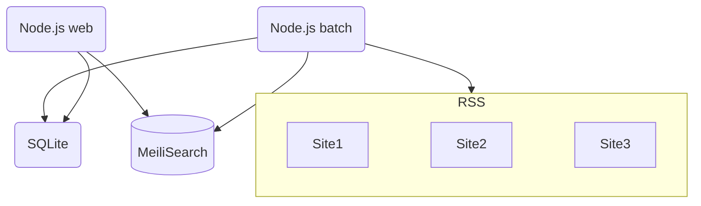

# Next.js + MeiliSearch Curator

## 概要

フィード（RSS）を収集して一覧表示するキュレーションサイトです。  
Next.js（Typescript, React）入門のため作成しました。
DBにはMeiliSearchを使用しています。

参考サイト https://rss.ai-rticle.site/

## 特徴

- フィードをバッチ処理で自動収集
- レスポンシブデザインのウェブサイト
- MeiliSearchを利用した全文検索
- Next.jsはApp Routerを使用

## 開発環境
- Docker Desktop 4.12.0
- Ubuntu 22.04.3 LTS（Windows 11 WSL上）
- Node.js v21.6.0
    - Next.js 14.1.0
        - React 18.2.0
        - TypeScript 5.3.3
        - Tailwind CSS 4.0.0
        - lint 0.1.0
- Meilisearch 1.6.0

開発環境構築用のリポジトリを下記で公開しています。  
https://github.com/joyrswd/curation-dev-environment


## システム構成  


## インストール

1. Node.jsとMeiliSearchの動作環境を用意（開発環境参照）
2. 下記コマンドでMeiliSearchを起動させる
    ```bash
    cd <MeiliSearchをインストールした場所> && ./meilisearch --master-key="任意の文字列（UTF8で16バイト以上）"
    ```
3. 本リポジトリをクローンし、プロジェクトディレクトリに移動
4. 下記コマンドで各種Node.jsモジュールをインストールする  
    ```bash
    npm install
    ```
5. app/_/conf/app.ts.exampleをコピーしてapp.tsファイルを作成し、各種値を設定する
6. 下記コマンドを実行して、データベースの初期設定を行う
    ```bash
    npm run batch:init
    ```
7. 下記コマンドを実行して、対話形式でのRSS登録を行う
    ```bash
    npm run batch:manage
    ```
8. 下記コマンドでRSS収集バッチと開発ウェブサーバーを起動させる
    ```bash
    nohup sh dev-starter.sh &
    ```
9. ブラウザでサイトのトップページへアクセスし表示を確認する  

以上

## ディレクトリ構成(主要部分)
```
.
├── __tests__               : テストスクリプトを格納するディレクトリ
├── app
│   ├── _
│   │   ├── batch           : バッチスクリプトを格納するディレクトリ
│   │   ├── components      : 再利用可能なUIコンポーネントを格納するディレクトリ
│   │   ├── conf            : 設定ファイルを格納するディレクトリ
│   │   ├── lib             : 汎用的なユーティリティ関数を格納するディレクトリ
│   │   └── log             : ログファイルを格納するディレクトリ
│   ├── @baseline           : （オプション）コンテンツの直下への表示用ディレクトリ
│   ├── @bottom             : （オプション）ページ最下部への表示用ディレクトリ
│   ├── @children
|   |   ├── [[...slug]]
|   |   |   └── page.tsx    : メインコンテンツを表示するためのReactコンポーネント
│   |   └── daily/[date]
│   │       └── page.tsx    : 日別ページを表示するためのReactコンポーネント
│   ├── @top                : （オプション）コンテンツの直上への表示用ディレクトリ
│   ├── api
│   │   ├── daily
│   │   │   └── route.ts    : 日別一覧のルーティングを定義するファイル
│   │   └── route.ts        : APIのルーティングを定義するファイル
│   ├── global.css          : 全体に適用するスタイルシート
│   └── layout.tsx          : 全体のレイアウトを定義するReactコンポーネント
.
.
.
```
### Tips
<details>
<summary>_, @, [[..slug]]などの特殊記号について</summary>  

- **_（アンダーバー）：プライベートフォルダ** -- 先頭に_を付けるととなり、配下のファイルはすべてルートの対象外となります。  
https://nextjs.org/docs/app/building-your-application/routing/colocation#private-folders
- **@ ：パラレルルート** -- 当該ディレクトリ名はURLパスの対象外となります。また直上のlayout.tsxからその配下のpage.tsxの内容を呼び出す事ができます。  
https://nextjs.org/docs/app/building-your-application/routing/parallel-routes
- **[[...slug]]：ダイナミックルート** -- []で囲むとURLパスの当該部分が変数のような扱いとなり、配下のpage.tsxでその値を受け取ることができます。  
https://nextjs.org/docs/app/building-your-application/routing/dynamic-routes
</details>

<details>
<summary>オプション（@baseline, @bottom, @top）</summary>  

    オプションのディレクトリには空白を表示させるdefault.tsxファイルと  
    [[...slug]]ディレクトリが配置してあります。

    本番など特定の環境で表示したいコンテンツ（広告など）がある場合、  
    [[...slug]]ディレクトリ配下にpage.tsxファイル(git管理外)を設置すると、  
    その環境で表示されるようになります。  

    またpage.tsx内でimport "./xxx.css"のようにスタイルシートを呼ぶことで、
    スタイルの上書きを行うことも可能です。
</details>

<details>
<summary>コンテンツ追加について</summary>  

    @children配下のgit管理対象ファイルは次の通りです。  
    - 直下のファイル  
    - [[...slug]]ディレクトリ配下のファイル  
    - dailyディレクトリ配下のファイル  
    上記以外のディレクトリはgit管理対象外となるため、  
    そちらへは任意のファイルを追加可能です。

</details>


## ライセンス

このプロジェクトは[MITライセンス](LICENSE)の下でライセンスされています。

