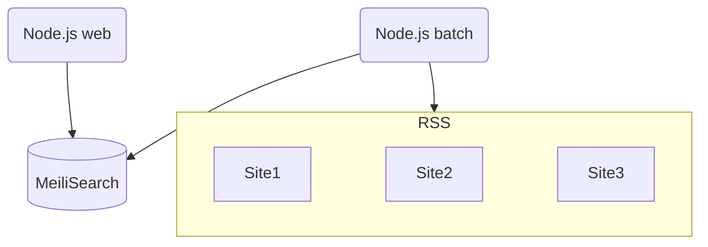

# Next.js + MeiliSearch Curator

## 概要

フィード（RSS）を収集して一覧表示するキュレーションサイトです。  
Next.js（Typescript, React）入門のため作成しました。
DBにはMeiliSearchを使用しています。

## 特徴

- フィードをバッチ処理で自動収集
- レスポンシブデザインのウェブサイト
- MeiliSearchを利用した全文検索
- Next.jsはApp Routerを使用

## 開発環境
- Docker Desktop 4.12.0
- Ubuntu 22.04.3 LTS（Windows 11 WSL上）
- Node.js v21.6.0
    - Next.js 14.1.0
        - React 18.2.0
        - TypeScript 5.3.3
        - Tailwind CSS 4.0.0
        - lint 0.1.0
- Meilisearch 1.6.0

開発環境構築用のリポジトリを下記で公開しています。  
https://github.com/joyrswd/curation-dev-environment


## システム構成  


## インストール

1. Node.jsとMeiliSearchの動作環境を用意（開発環境参照）
2. 下記コマンドでMeiliSearchを起動させる
    ```bash
    cd <MeiliSearchをインストールした場所> && ./meilisearch --master-key="任意の文字列（UTF8で16バイト以上）"
    ```
3. 本リポジトリをクローンし、プロジェクトディレクトリに移動
4. 下記コマンドで各種Node.jsモジュールをインストールする  
    ```bash
    npm install
    ```
5. app/_/conf/app.ts.exampleをコピーしてapp.tsファイルを作成し、各種値を設定する
6. app/_/conf/rss.ts.exampleをコピーしてrss.tsファイルを作成し、各種値を設定する
7. 下記コマンドでRSS収集バッチと開発ウェブサーバーを起動させる
    ```bash
    nohup sh dev-starter.sh &
    ```
8. ブラウザでサイトのトップページへアクセスし表示を確認する  

以上


## ライセンス

このプロジェクトは[MITライセンス](LICENSE)の下でライセンスされています。

